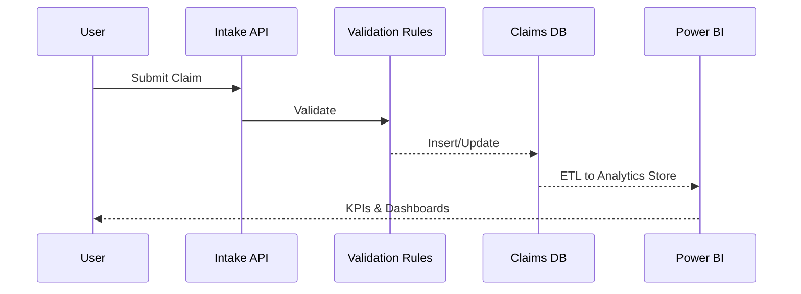
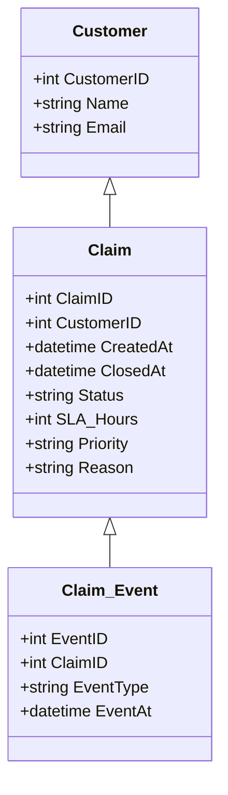

# System Design

## High-Level Architecture
```mermaid
flowchart LR
  A[Client (Web/Form/API)] -->|REST| G(API Gateway)
  G --> V[Validation Service]
  V --> C[Claims Service (.NET)]
  C --> D[(SQL Server)]
  C --> Q[(Queue/Events)]
  Q --> P[Processing Workers]
  D --> E[ETL]
  E --> BI[Power BI]
```

## Data Flow (Level 0)


## Simplified ER Model

